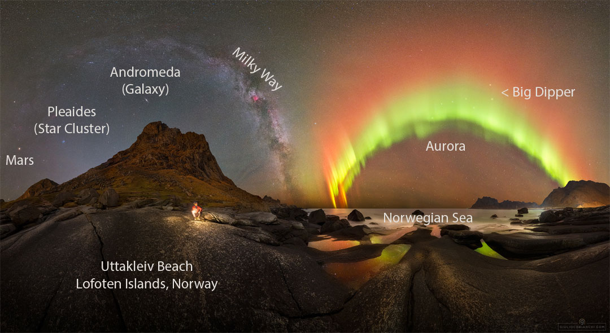

> *神秘北极圈 阿拉斯加的山巅 谁的脸 出现海角的天边* ——《欧若拉》张韵涵

作为一种绚丽的天文现象，**极光**总是引人注目。当来自太阳的高能粒子与被地球磁场引导进入地球大气层，绚丽的极光便在它们与气体分子间的碰撞间产生了。要进行较为精确的极光预报，从各种数据中获取这些粒子与地球磁场的互动情况就显得尤为重要。当太阳活动剧烈时，在我国纬度最高的黑龙江和新疆北部地区有机会看到极光。2024年5月，强烈的太阳活动一度使得可见极光的界限推进到华北地区，北京、秦皇岛、甚至大连的天文爱好者们，都有幸一睹极光的真容。这十余年未见的强烈极光活动也为我们提供了一次难得的机会，探索如何预测极光的出现情况。本文将按时间顺序，以2024年5月的极光活动为例，介绍极光发展的全过程，并简要的阐述如何利用互联网上公开的各种数据，对极光活动进行预测。

## 极光的起源：太阳耀斑与日冕物质抛射
---
当太阳表面的磁力线发生重组现象时，一些粒子因被磁场束缚，达到极高的温度，同时放出大量X射线辐射，这便是太阳耀斑的由来。由于地球大气会阻挡绝大部分X射线，安置在大气层之外人造卫星上的X射线相机和流量仪是观测太阳耀斑的主要手段。太阳耀斑发生时，卫星图片上会显示出明显的亮区，X射线流量仪所探测到的流量也会显著上升。

实时太阳X射线成像：[SDO卫星](https://solarham.com/sdoimagery.htm) [GOES卫星](https://solarham.com/goes16.htm)

实时X射线流量：[GOES卫星](https://www.swpc.noaa.gov/products/goes-x-ray-flux)

按照X射线流量的从小到大，耀斑也被分为A、B、C、M和X级，同级别的耀斑中，字母后跟的数字越大，耀斑越强烈。一般来说，高于M2.5级的耀斑就代表着强烈的太阳活动。

耀斑发生的同时，往往伴随着日冕物质抛射（Coronal Mass Ejection， 简称**CME**）。混乱的磁场使得太阳表面的大量的高能粒子逃逸。同时，这些高能粒子也在持续发光，因此可被卫星上的观测太阳周边的日冕仪观测到。当日冕仪上出现了环状的CME图像（Halo CME）时，便表明该次CME朝着地球方向而来，换句话说，极光已经在路上了。

[photo]

[/photo]

日冕仪图像：[Helioviewer](https://helioviewer.org/)[^选择SOHO-LASCO-Running Difference可以更好观察CME] [SolarHam](https://solarham.com/lasco.htm)

与X射线不同的是，这些造成极光的高能粒子的速度只有数百至数千公里每秒，远低于光速，这就为极光的预报争取到了时间。

